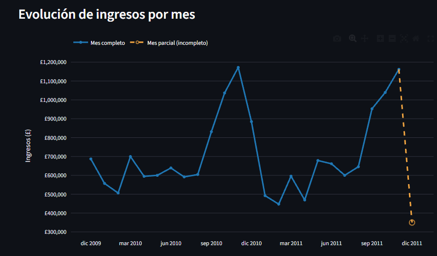

# 📈 RetailPulse

**Panel interactivo de ventas y segmentación de clientes (RFM) para una tienda online.**

RetailPulse convierte más de 800 mil líneas de transacciones en un tablero que responde preguntas de negocio: ¿cuánto vendemos?, ¿qué productos dominan?, ¿quiénes son nuestros mejores clientes?, ¿a quién deberíamos intentar recuperar?

🔗 **Demo en vivo:** _[Demo streamlit](https://retailpulse-francoagustingt.streamlit.app/)_



---

## ✨ Funcionalidades

- **Filtros interactivos** por rango de fechas, país y segmento de cliente.
- **4 KPIs clave:** ingresos totales, número de clientes, ticket promedio y número de pedidos.
- **Evolución mensual** de los ingresos (gráfico de línea).
- **Top 10 de productos** por ingreso.
- **Segmentación RFM:** treemap de ingreso y gráfico de barras con el número de clientes por segmento.
- **Lista descargable en CSV** de los clientes de cada segmento, lista para campañas de marketing.
- **Insights automáticos** redactados en lenguaje de negocio que se actualizan con los filtros.
- **Carga rápida** gracias al uso de `@st.cache_data`.

## 🧠 ¿Qué es el análisis RFM?

Técnica de marketing que califica a cada cliente con tres métricas:

| Métrica | Pregunta que responde | Cómo se calcula |
|---|---|---|
| **R**ecencia | ¿Cuándo compró por última vez? | Días desde su última compra hasta un día después de la última fecha del dataset |
| **F**recuencia | ¿Con qué frecuencia compra? | Número de facturas únicas |
| **M**onto | ¿Cuánto gasta? | Suma de `Quantity × Price` |

Cada métrica recibe un puntaje de 1 a 5 (quintiles) y, con ellos, cada cliente se asigna a un segmento:

| Segmento | Significado | Acción sugerida |
|---|---|---|
| 🏆 **Campeones** | Compraron hace poco y compran mucho | Premiar y dar trato preferente |
| 💚 **Clientes Leales** | Compran con regularidad | Programas de fidelidad, venta cruzada |
| 🌱 **Potenciales** | Recientes, con poco historial | Incentivar la segunda y tercera compra |
| ⚠️ **En Riesgo** | Eran buenos clientes, pero hace tiempo que no vuelven | Campañas de reactivación |
| 💤 **Perdidos** | Poca actividad y mucho tiempo sin comprar | Último intento de bajo costo |

## 🗂️ Estructura del proyecto

```
retailpulse/
├── app.py                  # Aplicación de Streamlit (todo el código)
├── requirements.txt        # Dependencias de Python
├── README.md               # Este archivo
├── notebooks/
│   └── Proyecto1_RFM.ipynb     # Análisis completo en Colab: limpieza, RFM y segmentos
└── data/
    ├── ventas_limpias.csv.gz   # Transacciones limpias (comprimido)
    └── clientes_rfm.csv        # RFM y segmento por cliente
```

## 📓 Notebook de análisis

El análisis que genera los datos de la app está en [`notebooks/Proyecto1_RFM.ipynb`](notebooks/Proyecto1_RFM.ipynb): carga del Excel original, limpieza, cálculo de Recencia, Frecuencia y Monto, puntajes por quintiles, segmentación y 3 hallazgos de negocio. Se puede ejecutar en [Google Colab](https://colab.research.google.com/) subiendo `online_retail_II.xlsx`.

## 🚀 Ejecutar en tu computador

1. Clona el repositorio y entra en la carpeta:
   ```bash
   git clone https://github.com/TU_USUARIO/retailpulse.git
   cd retailpulse
   ```
2. (Opcional) Crea un entorno virtual:
   ```bash
   python -m venv venv
   source venv/bin/activate        # En Windows: venv\Scripts\activate
   ```
3. Instala las dependencias:
   ```bash
   pip install -r requirements.txt
   ```
4. Lanza la aplicación:
   ```bash
   streamlit run app.py
   ```
5. Se abrirá en tu navegador en `http://localhost:8501`.

## 📊 Datos

- **Fuente:** dataset público [Online Retail II (UCI Machine Learning Repository)](https://archive.ics.uci.edu/dataset/502/online+retail+ii): transacciones de una tienda online del Reino Unido entre diciembre de 2009 y diciembre de 2011.
- **Moneda:** libras esterlinas (£).
- **Limpieza aplicada:** se eliminaron filas sin `Customer ID`, facturas canceladas (que empiezan con "C"), registros con cantidad o precio menores o iguales a 0 y 2 pedidos atípicos de más de 70 mil unidades que se anularon el mismo día (su anulación ya estaba excluida, pero la compra original no).
- **Top 10 de productos:** excluye cargos que no son productos (envío, ajustes manuales, descuentos, comisiones bancarias).
- **Meses parciales:** diciembre de 2011 solo llega hasta el día 9; el gráfico lo marca con línea punteada para no confundirlo con una caída real.

## 🛠️ Tecnologías

[Python](https://www.python.org/) · [Streamlit](https://streamlit.io/) · [pandas](https://pandas.pydata.org/) · [Plotly](https://plotly.com/python/)

## 👤 Autor

**Franco Agustin Gomez Torres** · [LinkedIn](https://www.linkedin.com/in/franco-agustin-gomez-torres-9341213b8/) · [GitHub](https://github.com/FrancoAgustinGomezTorres)

---

_Proyecto de portafolio en análisis de datos._
